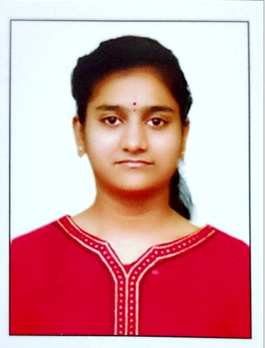

# Rachamalla Hindusree

   
*** 
I am **Rachamalla Hindusree**, 2103128 from **CSE** branch. I am from *Anantapur(District)
            , Andhra Pradesh(State)*. I am studing B-Tech 1st year year from Institute **IIT GOA**. My hobbies are
        **reading books, listening music** and **playing Badminton**
        I completed my 10th from *Sri Chaitanys English Medium School* in Anantapur. Then continued my inter in
        **Hyderabad**. I am fond of listening music. I am present persuing CSE course from IIT GOA. 
*** 
## **Education**
| Year of graduation | Degree | Institution |  
| :------------------: | :------: | ----------- |  
| 2024 | B.Tech | Indian Institute of Technology Goa |  
| 2021 | 12th standard | Sri Chaitanya Junior College |  
| 2019 | 10th standard | Sri Chaitanya English Medium School |  
***  
## 1st-year Courses @ IIT Goa  
### Autumn 2021-2022  
 + **MTH101**: Mathamathics by *Sandipan De*
 + **PH101** : Quantum Physics by  *Santosh Kumar Das* 
 + **HS101** : Foundation Programme in Humanities by *Sabiha Hashami*
 + **CH102** : Organic Chemistry by *Rishikesh Narayan*
 + **CS101** : Introduction to Computing by *Dr Clint.P.George*   link: 
[https://clintpgeorge.github.io/cs-101/autumn-2021/](https://clintpgeorge.github.io/cs-101/autumn-2021/)
 + **CH101** : Inorganic chemistry by *Dr Raja Mitra*
 + **CH104** : Chemistry lab by *Rishikesh Narayan and Raja Mitra* 
### Spring 2021-2022 
1. **MTH1021** : Basic Algebra <u> kalpesh Haria </u>
2. **PH102**: Electricity and Magnetism by <u> Vaibhav Wasnik </u>
3. **BIO101**: Evolution by <u> Sreenath Balakrishnan </u>
4. **ME102** : Engineering graphics and Computer Aided Design by <u> Anirudh Ambekar </u>
5. **CS102** : Software Tools by <u> Dr Clint.P.George </u> link: [href=https://clintpgeorge.github.io/cs-102/spring-2022/git/](https://clintpgeorge.github.io/cs-102/spring-2022/git/)  
***  
## Extracurricular activities  
> My Hobbies are playing games, Playing Badminton, and listining music. Learning about unkown things. Nature lover.

        

